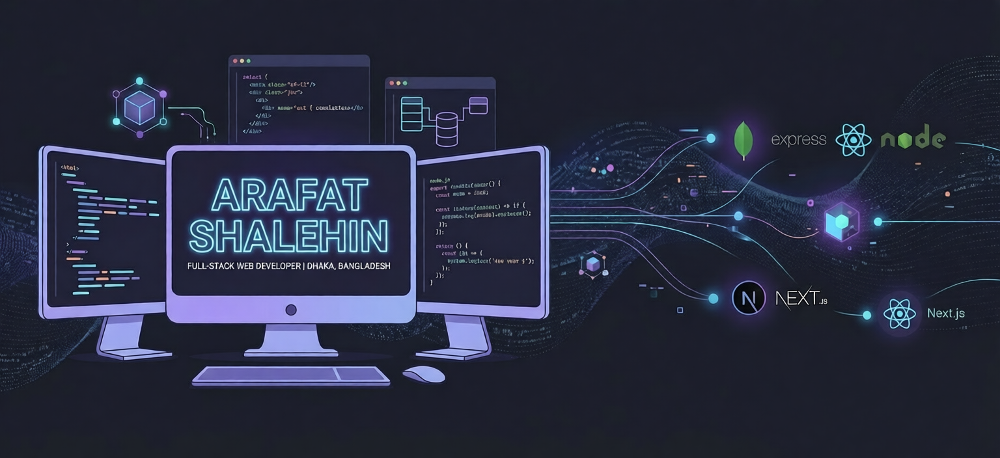

  

<h1 align="center">Hi, I’m Arafat 👋</h1>

  
  
  

---

### ⚡ Quick Overview
I am a **Full-Stack Web Developer** specializing in the **MERN** ecosystem. I don't just write code; I architect solutions. My focus lies in creating seamless user experiences backed by robust, high-performance server logic.

- 🔭 **Current Project:** Architecting a scalable SaaS platform using **Next.js 14** and **BullMQ**.
- 🧪 **Researching:** Distributed systems, Redis caching strategies, and Docker orchestration.
- ⚡ **Fun Fact:** I believe a clean folder structure is a love letter to your future self.

---

### 💻 My Tech Universe
<table width="100%">
  <tr>
    <td width="50%" valign="top">
      <h4>🚀 Frontend & UI</h4>
      
    </td>
    <td width="50%" valign="top">
      <h4>⚙️ Backend & DB</h4>
      
    </td>
  </tr>
  <tr>
    <td width="50%" valign="top">
      <h4>🛠️ Tools & Dev-Ops</h4>
      
    </td>
    <td width="50%" valign="top">
      <h4>🌐 Deployment</h4>
      
    </td>
  </tr>
</table>

---

### 📈 GitHub Ecosystem

  
  

  

  

---

### 🤝 Let's Connect & Collaborate

